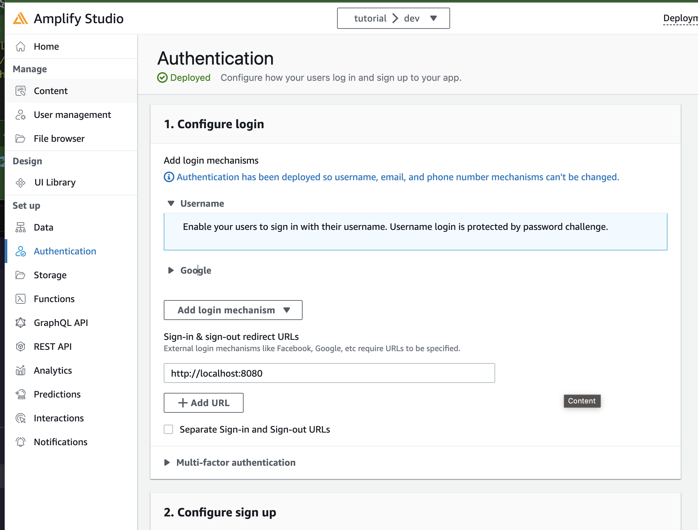

## Links

- [Amplify UI: customization](https://ui.docs.amplify.aws/vue/connected-components/authenticator/customization)
- [Amplify Configuration: social providers](https://ui.docs.amplify.aws/vue/connected-components/authenticator/configuration#social-providers)

## Google ログイン

https://www.youtube.com/watch?v=8KwZNn56F78

### Google Cloud で準備

OAuth 同意画面 > 認証情報

### Amplify Studio

で確認した。

## social login

- フェデレーションユーザーはユーザープールに直接存在しないかも
  - **存在しないことによるデメリットはあるか**
  - **そもそもユーザープールって何か**
- なんとかしてユーザープールに含めることも可能らしい
