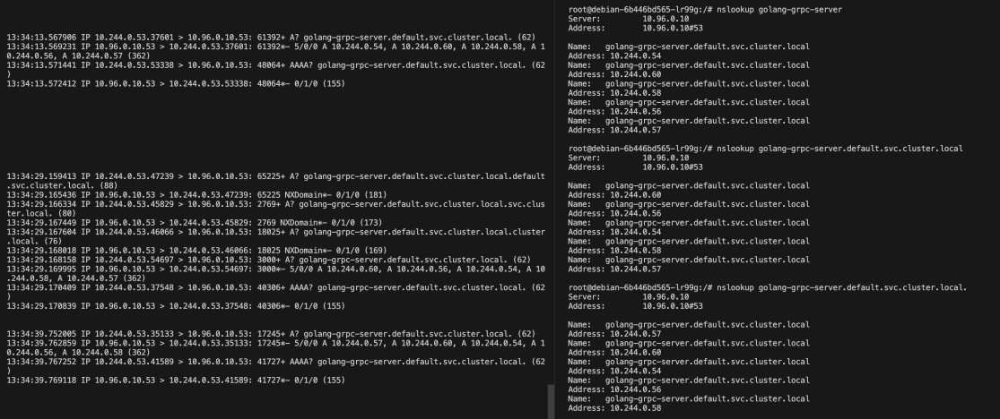

## [kind](https://kind.sigs.k8s.io/docs/user/quick-start/#installation)

``` sh
kind create cluster --name local-dev

kind delete cluster --name local-dev
kind create cluster --name local-dev --config k8s-cluster-config.yaml


kind get clusters


kubectl get services

# check configurations
helm install sample-service --dry-run --debug ./sample-service-helm

# with node port (access from outside)あ
helm install sample-service ./sample-service-helm --set service.type=NodePort --set service.nodePort=31234


❯ kubectl get services

NAME                                 TYPE        CLUSTER-IP      EXTERNAL-IP   PORT(S)        AGE
kubernetes                           ClusterIP   10.96.0.1       <none>        443/TCP        21m
sample-service-sample-service-helm   NodePort    10.98.250.140   <none>        80:31234/TCP   41s


helm delete sample-service


❯ kubectl get pods
NAME                                                  READY   STATUS    RESTARTS   AGE
sample-service-sample-service-helm-6b44897c57-btrfz   0/1     Evicted   0          8m45s
sample-service-sample-service-helm-6b44897c57-bznsn   0/1     Pending   0          117s
sample-service-sample-service-helm-6b44897c57-nqwhj   0/1     Evicted   0          23m

kubectl describe pod sample-service-sample-service-helm-6b44897c57-btrfz

❯ kubectl get nodes
NAME             STATUS   ROLES           AGE   VERSION
docker-desktop   Ready    control-plane   35m   v1.28.2

# Pending のまま問題。
# https://qiita.com/nykym/items/dcc572c21885543d94c8
❯ kubectl describe node docker-desktop | grep Taints
Taints:             node.kubernetes.io/disk-pressure:NoSchedule
#   Warning  FailedScheduling  11m (x2 over 16m)  default-scheduler  0/1 nodes are available: 1 node(s) had
#   untolerated taint {node.kubernetes.io/disk-pressure: }. preemption: 0/1 nodes are available: 1 Preemption is not helpful for scheduling..

kubectl taint nodes docker-desktop node.kubernetes.io/disk-pressure:NoSchedule-
kubectl taint node docker-desktop node.kubernetes.io/disk-pressure:NoSchedule-


kubectl get nodes -o json | jq '.items[].spec.taints'


helm uninstall sample-service

helm install sample-service ./sample-service-helm --set service.type=NodePort --set service.nodePort=31234

helm upgrade sample-service ./sample-service-helm --set service.type=NodePort --set service.nodePort=31234


# kind にローカルの dockerfile を登録する。
kind load --name local-dev docker-image sample-service:latest

kind load --name local-dev docker-image golang-bff:latest


# this is not working...?
## this causes Backoff...
helm upgrade -n kube-system --install -f values.yaml metrics-server metrics-server/metrics-server

# NOT specified values.yaml
helm upgrade -n kube-system --install metrics-server metrics-server/metrics-server

helm uninstall -n kube-system metrics-server metrics-server/metrics-server


kind load --name local-dev docker-image golang-bff:latest
kind load --name local-dev docker-image sample-service:latest
kind load --name local-dev docker-image my-nginx:latest
kind load --name local-dev docker-image golang-grpc:latest

helm upgrade sample-service ./sample-service-helm --set service.type=NodePort --set service.nodePort=31234


helm install sample-service ./sample-service-helm --set service.type=NodePort --set service.nodePort=31234


## dnsutils を入れる
kubectl apply -f https://k8s.io/examples/admin/dns/dnsutils.yaml
kubectl exec dnsutils -- nslookup golang-grpc-server
kubectl exec dnsutils -- cat /etc/resolv.conf
```

- metadata の不要なラベルを削除
- この辺の記載を合わせる
  - deployment
    - spec.selector.matchLabels
    - spec.template.metadata.labels
  - service
    - spec.selector


## Ingress

- [controller を有効にする](https://kind.sigs.k8s.io/docs/user/ingress/#ingress-nginx)

``` sh
kind create cluster --name local-dev-ingress --config cluster-with-ingress.yaml


kubectl exec -it nginx-ingress-controller-xxx-yyy -- cat nginx.conf

```


## k8s dashboard

``` sh
kubectl apply -f https://raw.githubusercontent.com/kubernetes/dashboard/v2.7.0/aio/deploy/recommended.yaml
kubectl get pod -n kubernetes-dashboard
kubectl create serviceaccount -n kubernetes-dashboard admin-user\nkubectl create clusterrolebinding -n kubernetes-dashboard admin-user --clusterrole cluster-admin --serviceaccount=kubernetes-dashboard:admin-user
token=$(kubectl -n kubernetes-dashboard create token admin-user)
echo $token
kubectl proxy
echo see: http://localhost:8001/api/v1/namespaces/kubernetes-dashboard/services/https:kubernetes-dashboard:/proxy/\#/workloads\?namespace\=default


$ kubectl exec dnsutils -- nslookup golang-grpc-server
Server:         10.96.0.10
Address:        10.96.0.10#53

Name:   golang-grpc-server.default.svc.cluster.local
Address: 10.244.0.35
Name:   golang-grpc-server.default.svc.cluster.local
Address: 10.244.0.36
Name:   golang-grpc-server.default.svc.cluster.local
Address: 10.244.0.34
Name:   golang-grpc-server.default.svc.cluster.local
Address: 10.244.0.29
Name:   golang-grpc-server.default.svc.cluster.local
Address: 10.244.0.33
```

## ERRORs

### selector

``` sh
helm upgrade sample-service ./sample-service-helm --set service.type=NodePort --set service.nodePort=31234
Error: UPGRADE FAILED: cannot patch "debian" with kind Deployment: Deployment.apps "debian" is invalid: spec.selector: Invalid value: v1.LabelSelector{MatchLabels:map[string]string{"app":"debian"}, MatchExpressions:[]v1.LabelSelectorRequirement(nil)}: field is immutable
make: *** [upgrade] Error 1
```

> 表示されたエラーは、KubernetesにおけるDeploymentのspec.selectorフィールドの不変性に関連しています。Kubernetesでは、一度作成されたDeploymentのspec.selectorフィールドは変更できません。このエラーメッセージは、既存のDeploymentのspec.selectorを変更しようとしたときに発生します。

## DNS



書いてみた。

https://koko206.hatenablog.com/entry/2023/11/25/020948

## Auto Scaling

- k8s の機能
  - Cluster Auto Scaling
    - pod がスケジューリングできない状況になった時、クラウドプロバイダが提供する API を通して自動で Node を追加
    - https://github.com/kubernetes/autoscaler/tree/master/cluster-autoscaler
    - EKS ならこれがベストらしい: https://karpenter.sh/
  - Pod Auto Scaling
    - HPA
    - VPA

### [HPA](https://kubernetes.io/ja/docs/tasks/run-application/horizontal-pod-autoscale-walkthrough/)

- Metrics APIを介してメトリクスを提供するために、Metrics serverによるモニタリングがクラスター内にデプロイされている必要があります

``` sh
helm upgrade -n kube-system --install metrics-server metrics-server/metrics-server
```

```
Back-off restarting failed container metrics-server in pod
```

``` sh
  Warning  Unhealthy  3s (x10 over 83s)  kubelet            Readiness probe failed: HTTP probe failed with statuscode: 500
```

``` sh
kubectl edit deploy metrics-server -n kube-system
```

kubelet-insecure-tls と v2 を入れるだけ。

**ここもチャートとして yaml ファイルで持っておきたい（helm install しなくて済むようにしたい）。**

``` yaml
      - args:
        - --cert-dir=/tmp
        - --secure-port=4443
        - --v=2
        - --kubelet-insecure-tls
        - --kubelet-preferred-address-types=InternalIP
```

``` sh
kt top pod

kc get hpa

# watch する！
kc get hpa -w
```

サーバー側のコネクション時間の設定とかして切断を切ったりしなくとも、hpa で増えた pod にリクエストされてるように見える。。。？

→ 嘘だった。。。されてなかった。

Server 側で Timeout しておくと、接続が切れたタイミングでその時の数に合わせられることは確認した。

### Links

- [Kubernetes上でgRPCサービスを動かす](https://deeeet.com/writing/2018/03/30/kubernetes-grpc/)
  - 2018/03

## Subcharts

- [helm-best-practice](https://www.argonaut.dev/blog/helm-best-practices)

## istio

[Install with Helm](https://istio.io/latest/docs/setup/install/helm/)

metallb 不要な気がする。。。？

``` sh
kubectl apply -f https://raw.githubusercontent.com/metallb/metallb/v0.13.7/config/manifests/metallb-native.yaml
kubectl wait --namespace metallb-system --for=condition=ready pod --selector=app=metallb --timeout=90s
kubectl apply -f sample-service-helm/templates/metallb.yaml
kubectl apply -f https://raw.githubusercontent.com/kubernetes/dashboard/v2.7.0/aio/deploy/recommended.yaml\n

kubectl apply -f https://kind.sigs.k8s.io/examples/loadbalancer/metallb-config.yaml

kubectl apply -f sample-service-helm/templates/metallb.yaml
```

多分ここから

``` sh
helm repo add istio https://istio-release.storage.googleapis.com/charts
helm repo update
```

``` sh
# ns の作成、ラベル付与って helm で無理なん？
kubectl create namespace istio-system
helm install istio-base istio/base -n istio-system --set defaultRevision=default
```

``` sh
# istioctl install --set profile=demo -y
istioctl install --set profile=default -y
# ns にラベル付与。
kubectl label namespace default istio-injection=enabled

kubectl get ns -L istio-injection

kc get all
```

``` sh
# https://istio.io/latest/about/faq/security/#enabling-disabling-mtls
apiVersion: security.istio.io/v1beta1
kind: PeerAuthentication
metadata:
  name: "default"
  namespace: "istio-system"
spec:
  mtls:
    mode: DISABLE
```

``` sh
# curl http://sample-service-sample-service-helm:15555/js
Upgrade Required# curl -v http://sample-service-sample-service-helm:15555/js
*   Trying 10.96.197.127:15555...
* Connected to sample-service-sample-service-helm (10.96.197.127) port 15555 (#0)
> GET /js HTTP/1.1
> Host: sample-service-sample-service-helm:15555
> User-Agent: curl/7.88.1
> Accept: */*
>
< HTTP/1.1 426 Upgrade Required
< server: envoy
< date: Tue, 05 Dec 2023 14:18:22 GMT
< content-type: text/plain
< content-length: 16
< x-envoy-upstream-service-time: 49
<
* Connection #0 to host sample-service-sample-service-helm left intact
Upgrade Required# curl -v http://sample-service-js:8080
*   Trying 10.96.216.16:8080...
* Connected to sample-service-js (10.96.216.16) port 8080 (#0)
> GET / HTTP/1.1
> Host: sample-service-js:8080
> User-Agent: curl/7.88.1
> Accept: */*
>
< HTTP/1.1 200 OK
< content-type: text/plain
< date: Tue, 05 Dec 2023 14:18:43 GMT
< content-length: 32
< x-envoy-upstream-service-time: 22
< server: envoy
<
You have reached sample service
* Connection #0 to host sample-service-js left intact

# curl --http1.0 -v http://sample-service-js:8080
*   Trying 10.96.216.16:8080...
* Connected to sample-service-js (10.96.216.16) port 8080 (#0)
> GET / HTTP/1.0
> Host: sample-service-js:8080
> User-Agent: curl/7.88.1
> Accept: */*
>
< HTTP/1.1 426 Upgrade Required
< content-length: 16
< content-type: text/plain
< date: Tue, 05 Dec 2023 14:19:32 GMT
< server: istio-envoy
< connection: close
<
* Closing connection 0
```

### Links

- [protocol をきちんとすることが大事](https://istio.io/latest/docs/ops/configuration/traffic-management/protocol-selection/#explicit-protocol-selection)
  - prefix of port name

## 負荷分散とか

`MaxConnectionAge` を入れたところ、以下のようなエラーが出るようになった。

``` sh

default golang-bff-server-766f55788b-l26ld golang-bff [GIN-debug] [WARNING] You trusted all proxies, this is NOT safe. We recommend you to set a value.
default golang-bff-server-766f55788b-l26ld golang-bff Please check https://pkg.go.dev/github.com/gin-gonic/gin#readme-don-t-trust-all-proxies for details.
default golang-bff-server-766f55788b-l26ld golang-bff [GIN-debug] Listening and serving HTTP on :8080
default golang-bff-server-766f55788b-l26ld golang-bff error: rpc error: code = Unavailable desc = closing transport due to: connection error: desc = "error reading from server: EOF", received prior goaway: code: NO_ERROR, debug data: "max_age"
default golang-bff-server-766f55788b-l26ld golang-bff [GIN] 2024/01/20 - 07:10:17 | 200 | 50.980960523s |     10.244.1.21 | GET      "/go"
default golang-bff-server-766f55788b-l26ld golang-bff Error #01: rpc error: code = Unavailable desc = closing transport due to: connection error: desc = "error reading from server: EOF", received prior goaway: code: NO_ERROR, debug data: "max_age"
```

- 毎回出るわけではない
- 全てのエンドポイントで出るわけではない
  - 時間がかかる部分の方が多め

### ローカルで実験

以下は全て Unary の endpoint で確認

- レスポンスにかかった時間よりは、データサイズに依存しそう
  - MaxConnectionAge = 15s, response 30s とかにして実験してた
  - レスポンスサイズを 1KB, 31KB, 33KB, 1MB, 100MB など変えて確認
    - `received message larger than max` みたいなエラーが出ることが多かったが, `max_age` が出ることも多々あった
- ReadBufferSize, WriteBufferSize がデフォルトの 32KB だった
  - データサイズが `WriteBufferSize` を越した時に複数に分けて送られるはずで、ここを越した時に GOAWAY が出るのかと思ってた
  - そこで色々と調整してみたけどうまくいかず。。。
    - server
      - WriteBufferSize
      - ReadBufferSize
    - client
      - WithInitialWindowSize
      - WithInitialConnWindowSize
  - 参考
    - [github: issue](https://github.com/grpc/grpc-go/issues/6019#issuecomment-1766167499)
    - [stream に関する issue](https://github.com/grpc/grpc-go/issues/6504)
- 常にエラーが出るわけではない

```
error at grpc client: rpc error: code = ResourceExhausted desc = grpc: received message larger than max (20480326 vs. 4194304)
```

- GOAWAY について
  - [RFC7540](https://datatracker.ietf.org/doc/html/rfc7540#section-6.8) で定義された http2 の frame の1つ
  - [HTTP/2 GOAWAY (qiita)](https://qiita.com/tatsuhiro-t/items/d9322b312f63488d6493)
- grpc
  - HTTP/2
    - コネクション (TCP)
      - GOAWAY フレームが送信された時に新規のストリームの作成を止めて、TCP コネクションを終了させる
      - [GOAWAY Frame](https://github.com/grpc/grpc/blob/master/doc/PROTOCOL-HTTP2.md#goaway-frame)
    - ストリーム
      - [ストリームの状態遷移](https://summerwind.jp/docs/rfc7540/#section5-1)
    - メッセージ
    - フレーム

TODO: 未解決

## 疑問

- Namespace って、区切られた間でできないことってある？
  - どれくらいの粒度で区切るのがいい？
- ns の作成、ラベル付与って helm で無理なん？

## Links

- [Local kubernetes with kind, helm and a sample service](https://faun.pub/local-kubernetes-with-kind-helm-and-a-sample-service-4755e3e6eff4)
- [kind でローカルの Dockerfile を使う](https://renjith85.medium.com/local-docker-registry-in-kubernetes-cluster-using-kind-8230075a7817)
- [distroless/base](https://github.com/GoogleContainerTools/distroless/blob/main/base/README.md)
